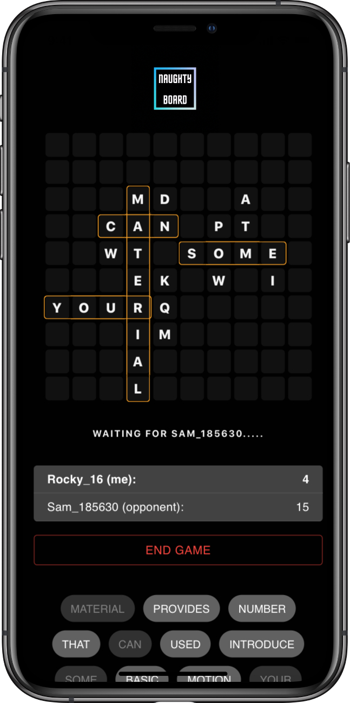

# Naughty Board game

Link to the game:

[https://mindwarmth.github.io/naughty-scrabble](https://mindwarmth.github.io/naughty-scrabble).

This project was created for The Lucky Wheel Hackathon.

## Game mechanics

Naughty Board is a peer-to-peer realtime board game.

The game board consists of 100 cells (10x10).

Players take turns filling an empty cells with letters. Letters built to a word grants score points.

Words are read from left to right and from top to bottom.

Repetitions are not score.

Dictionary of allowed words is submitting before the game start.

The goal of the game is to get more score points  than opponent.

But keep eye on your opponent. Earn extra points by completing opponent's word. Or show your devil's character by breaking his efforts to build a word :)

Game ends once all cells are filled with letters.

## Technical side

This project was bootstrapped with [Create React App](https://github.com/facebook/create-react-app).

It uses 3 mandatory APIs:

1. **Web Worker API**\
Is used for background calculations of game's math:
   - create dictionary from text;
   - find all possible words (chunks) from game board;

2. **Navigator.share()**\
Is used to share invitation to join the game.

3. **Clipboard API**\
Is used to read dictionary from clipboard and to copy invitation to clipboard.

And 2 additional:

4. **WebSockets API**\
Is used together with primitive remote WebSocket server to let players to have initial "handshake" before they can establish peer-to-peer connection using WebRTC.

5. **WebRTC**\
Is used for peer-to-peer communication between players during the game.

6. **Web Storage API**\
Is used to memorize player's username and dictionary for future games.

## Install and run

### Available Scripts

In the project directory, you can run:

#### `yarn start`

Runs the app in the development mode.\
Open [http://localhost:3000](http://localhost:3000) to view it in the browser.

#### `yarn deploy`

Builds the app in production mode and deploy it to the GitHub Pages.

## Peer-To-Peer Real Time Demo

